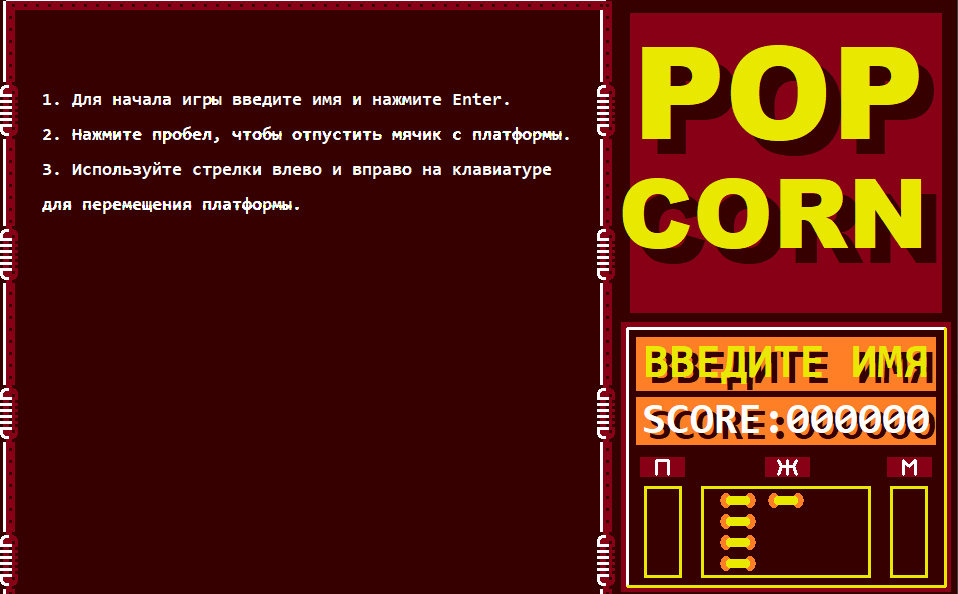
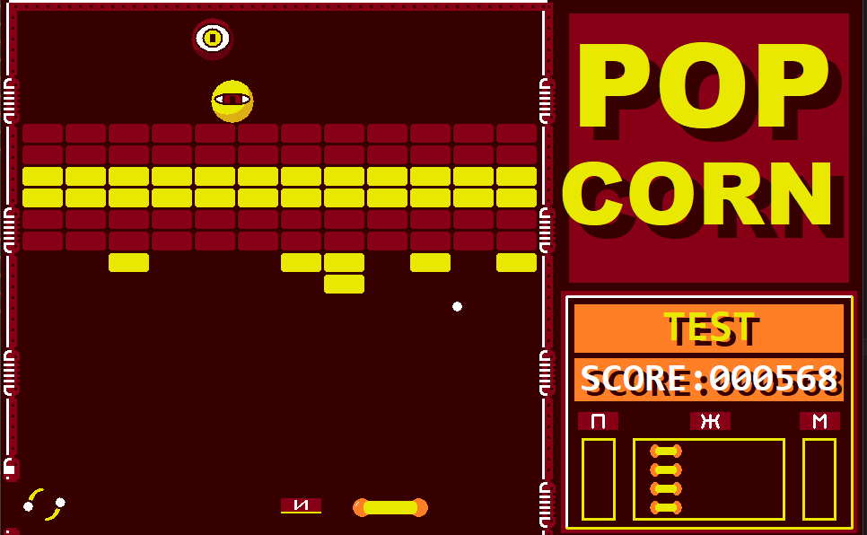

# PopCorn

Аркадная игра.

## Особенности

- 10 уровней

- Несколько видов кирпичей на уровне (обычные, неразбиваемые, порталы и тд)

- Выпадающие из кирпичей буквы (их поимка платформой влияет на игровые механики и состояния)

- Несколько игровых состояний платформы (расширенная, лазерная, с клеем)

- Пара видов монстров, вносящих дополнительный сумбур

## Готовность

В настоящий момент проект еще содержит пару известных багов, которые предстоит убрать.

## Лицензия

PopCorn - некоммерческий учебный проект по курсу А.Семенко "Базовый курс программирования на С++".

С изменениями и дополнениями.

Визуальная и игромеханическая основа - аркада Popcorn 1988 от разработчика Lacral Software.

Оригинальные код и файлы изображений при написании данного проекта не использовались.

